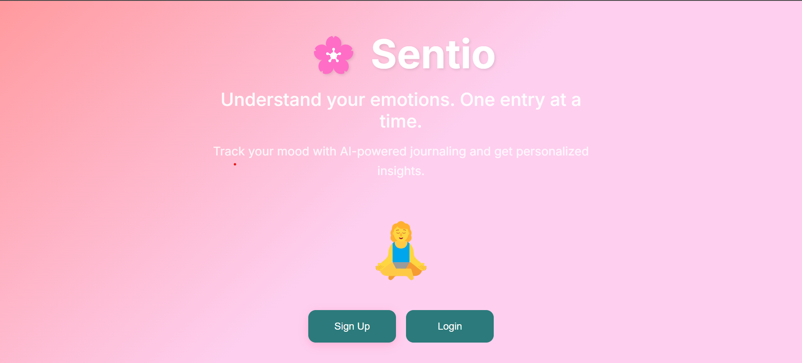
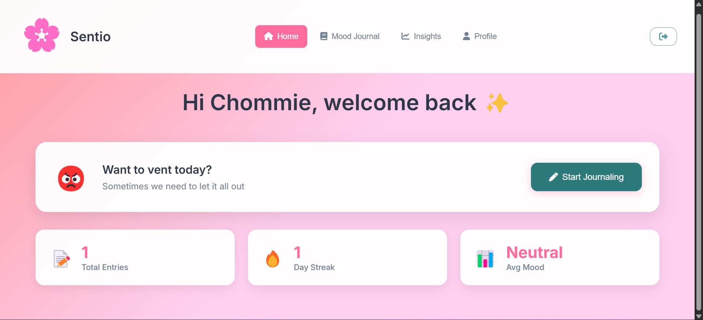
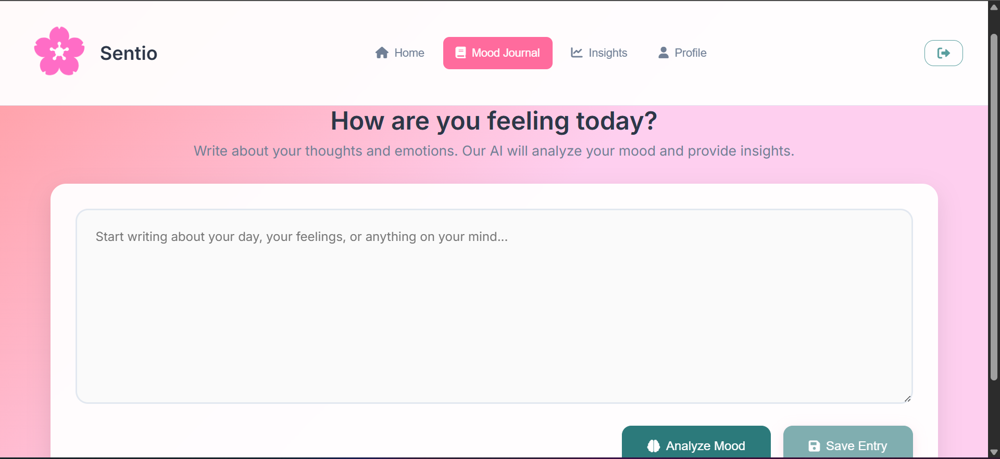
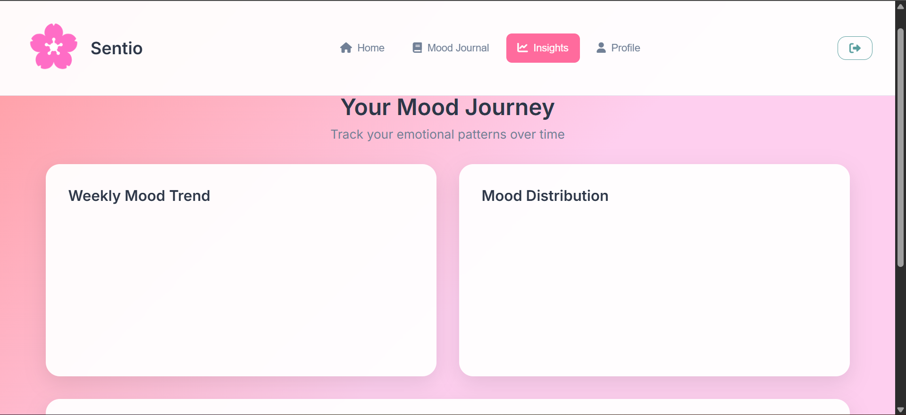
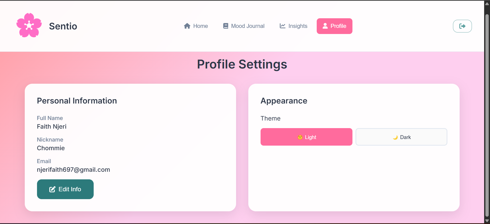

# 🌸 Sentio Mood Journal

<div align="center">
  
  <h3>Understand your emotions. One entry at a time.</h3>
</div>

Sentio is an AI-powered mood journaling app that helps users track, analyze, and understand their emotions. Built with Supabase and Hugging Face AI, it provides personalized insights in a simple, friendly interface.

## 📋 Table of Contents

- [Features](#-features)
- [Tech Stack](#-tech-stack)
- [Installation](#-installation)
- [Usage](#-usage)
- [Screenshots](#-screenshots)
- [Team](#-team)
- [Future Improvements](#-future-improvements)
- [License](#-license)

## ✨ Features

### 🔐 **Authentication & Security**
- User registration with name, nickname, email, password
- Secure login with Supabase authentication
- Terms & Conditions with privacy policy
- Session management and logout

### 📝 **Mood Journaling**
- Freeform text journaling interface
- AI-powered sentiment analysis (Happy/Sad/Angry percentages)
- Personalized AI advice based on mood analysis
- Save entries with mood data

### 🏠 **Personalized Dashboard**
- Rotating mood prompts with 6 different scenarios
- Quick stats: Total entries, day streak, average mood
- Personalized greeting with user nickname
- One-click navigation to journaling

### 📊 **Insights & Analytics**
- Weekly mood trend charts
- Mood distribution visualization
- Recent entries with mood labels
- CSV export functionality

### 🎨 **User Experience**
- Clean landing page with meditation illustration
- Dark/Light theme toggle (🌞/🌙)
- Responsive design for all devices
- Tab-based navigation (Home | Journal | Insights | Profile)
- Profile management with user info display

## 🛠️ Tech Stack

- **Frontend**: HTML5, CSS3, Vanilla JavaScript
- **Backend**: Supabase (Authentication & Database)
- **AI**: Hugging Face Sentiment Analysis API
- **Charts**: Chart.js for data visualization
- **Styling**: Custom CSS with pink gradient theme
- **Deployment**: Ready for Netlify deployment

## 🚀 Installation

### Prerequisites
- Modern web browser
- Supabase account (free tier available)
- Hugging Face account (optional for enhanced AI features)

### Setup Instructions

1. **Clone the Repository**
   ```bash
   git clone <your-repo-url>
   cd sentio-mood-journal
   ```

2. **Configure Supabase**
   - Create a new Supabase project
   - Set up authentication (enable email/password)
   - Create database tables using the provided schema
   - Add your Supabase URL and anon key to configuration

3. **Create env.js (Do NOT commit)**
   Create a file named `env.js` in the project root with your keys:
   ```html
   // env.js
   window._env_ = {
     VITE_SUPABASE_URL: "https://YOUR-PROJECT.supabase.co",
     VITE_SUPABASE_ANON_KEY: "YOUR_SUPABASE_ANON_KEY",
     VITE_HUGGINGFACE_API_KEY: "YOUR_HF_API_KEY" // optional
   };
   ```

4. **Run Locally**
   ```bash
   # Using Python
   python -m http.server 8080
   
   # Using Node.js
   npx serve .
   
   # Or open index.html directly in browser
   ```

5. **Access the App**
   - Open `http://localhost:8080` in your browser
   - Sign up for a new account
   - Start journaling and tracking your mood!

## 📱 Usage

1. **Landing Page**: Clean introduction with sign up/login options
2. **Authentication**: Register with name, nickname, email, and accept terms
3. **Dashboard**: View personalized greeting and rotating mood prompts
4. **Journal**: Write entries and analyze mood with AI
5. **Insights**: View mood trends and export data
6. **Profile**: Manage account and toggle themes

## 📸 Screenshots

### Landing Page
Clean hero section with meditation illustration and call-to-action buttons.



### Dashboard
Personalized greeting with rotating mood prompts and quick statistics.



### Mood Journal
AI-powered sentiment analysis with visual mood bars and personalized advice.



### Insights
Weekly trend charts and mood distribution with CSV export functionality.



### Profile
User profile with name, nickname, and theme settings.



## 👥 Team

**Faith Njeri** - Full Stack Developer
- Frontend development and UI/UX design
- Backend integration with Supabase
- AI sentiment analysis implementation
- Project architecture and deployment

## 🚀 Future Improvements

### Planned Features
- **Real Hugging Face API Integration**: Replace mock analysis with actual API calls
- **Advanced Analytics**: Monthly/yearly mood trends and deeper insights
- **Social Features**: Share anonymous mood insights with community
- **Mobile App**: React Native version for iOS/Android
- **Monetization**: Premium features with IntaSend payment integration

### Technical Enhancements
- **PWA Support**: Offline functionality and app-like experience
- **Push Notifications**: Daily journaling reminders
- **Data Backup**: Cloud backup and sync across devices
- **Advanced AI**: Emotion detection from text patterns and writing style

## 📄 License

This project is created for hackathon purposes. All rights reserved.
